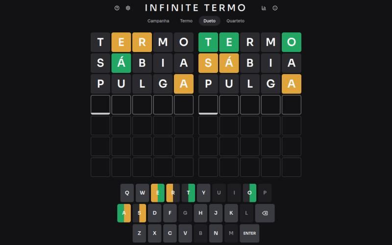

# Infinite Termo

Versão infinita do Termo: jogue quantas partidas quiser, sem esperar a palavra do dia.

**[Jogar agora →](https://infinite-termo.vercel.app)**

[](https://github.com/David-Santosx/infinite-termo/actions/workflows/ci.yml)



## Funcionalidades

- Modos Termo (1 tabuleiro, 6 tentativas), Dueto (2 tabuleiros, 7) e Quarteto (4 tabuleiros, 9).
- Campanha: percorre Termo, Dueto e Quarteto em sequência, com pontuação e recorde; errar encerra a sequência.
- Palpites sem acento: o jogo exibe a palavra acentuada corretamente.
- Estatísticas locais, com sequência e distribuição de tentativas.
- Compartilhamento do resultado em emojis.
- Alto contraste e tema claro, escuro ou do sistema.
- Teclado físico completo (letras, Enter, Backspace, Delete, setas, Home e End) e teclado na tela.

## Arquitetura

O estado da partida vive no servidor, dentro de um cookie criptografado. O cliente só renderiza o que a API devolve.

```
app/api/game/*   rotas HTTP (validação com zod)
      |
features/game/server    service, token (JWE), cookie, listas de palavras
      |
features/game/engine    regras puras: avaliar palpite, modos, campanha

features/game/components  --->  features/game/client
(UI React)                      (hooks, API, estatísticas, atalhos, compartilhamento)
```

- `engine`: funções puras e sem I/O; nada depende de Next ou React.
- `server`: orquestra o engine, sorteia respostas, valida palavras e sela o estado no cookie.
- `client`: consome `features/game/contract.ts`, o tipo público da partida, que nunca carrega a resposta de um tabuleiro em andamento.

### API

| Método | Rota                    | Corpo                                        | Resposta                                               |
| ------ | ----------------------- | -------------------------------------------- | ------------------------------------------------------ |
| GET    | `/api/game?mode=<modo>` | nenhum                                       | `PublicGame` da partida atual; cria uma se não existir |
| POST   | `/api/game/guess`       | `{ "mode": "<modo>", "guess": "<palavra>" }` | `PublicGame` atualizado                                |
| POST   | `/api/game/new`         | `{ "mode": "<modo>" }`                       | `PublicGame` de uma nova partida                       |

`<modo>` é `campaign`, `termo`, `dueto` ou `quarteto`. Erros retornam `{ "error": { "code", "message" } }`: 400 para requisição inválida, 409 se iniciar partida com outra em andamento ou palpitar em uma terminada, 422 para palpite inválido (tamanho, fora do dicionário ou repetido) e 500 para falhas internas. As respostas usam `Cache-Control: no-store`.

## Decisões técnicas

**Estado sem banco, em JWE.** A partida inteira, incluindo as respostas, é serializada e cifrada como JWE (`alg: dir`, `enc: A256GCM`, via [jose](https://github.com/panva/jose)) e gravada no cookie `it_state`, com `httpOnly`, `sameSite: lax` e `secure` em produção. A chave é o SHA-256 de `GAME_SECRET`. Consequências:

- As respostas só chegam ao cliente quando o tabuleiro é resolvido ou a partida termina; o JavaScript do navegador não consegue ler o cookie.
- Adulterar o token o invalida (A256GCM autentica o conteúdo) e o servidor começa um estado novo.
- O servidor é autoritativo e não precisa de banco, sessão ou armazenamento externo.

**Sem proteção contra replay.** O token é sem estado: um cookie antigo pode ser restaurado para repetir uma partida. É um trade-off aceito, por design, num jogo casual sem contas nem ranking.

**Estatísticas em `localStorage`.** Sequências e distribuição não são necessárias para validar nada no servidor e não exigem conta. Ficam no dispositivo, e nenhum dado pessoal é coletado. O tema e o alto contraste também ficam no `localStorage`.

## Rodando localmente

Requer Node 22.12 ou superior (há um `.nvmrc`).

```bash
npm install
cp .env.example .env.local
# preencha GAME_SECRET com: openssl rand -base64 32
npm run dev
```

Em desenvolvimento, sem `GAME_SECRET`, é usada uma chave fixa insegura. Em produção a variável é obrigatória: sem `GAME_SECRET`, as páginas renderizam, mas as chamadas à API retornam 500.

| Script                        | O que faz                      |
| ----------------------------- | ------------------------------ |
| `npm run dev`                 | servidor de desenvolvimento    |
| `npm run build` / `npm start` | build e servidor de produção   |
| `npm test`                    | testes com Vitest              |
| `npm run lint`                | ESLint                         |
| `npm run typecheck`           | `tsc --noEmit`                 |
| `npm run words`               | regenera as listas de palavras |

### Deploy

Na Vercel, a única configuração necessária é a variável de ambiente `GAME_SECRET`. Gere o valor com `openssl rand -base64 32`. Opcionalmente, defina `NEXT_PUBLIC_SITE_URL` (por exemplo `https://seu-dominio.com`) para as URLs de metadados e Open Graph; na Vercel, o domínio de produção é detectado automaticamente. Trocar a chave invalida as partidas em andamento, mas não afeta as estatísticas locais.

## Testes e CI

Os testes usam Vitest e cobrem o engine (avaliação de letras repetidas, normalização, regras de partida e campanha), o servidor (service, token JWE, cookie/erros HTTP e listas de palavras) e a lógica do cliente (entrada de texto, atalhos de teclado, estado do teclado, estatísticas e compartilhamento), além do script de geração de palavras. O GitHub Actions roda lint, typecheck, testes e build a cada push na `main` e em cada pull request.

## Palavras

- **Respostas:** 1497 palavras comuns de 5 letras, curadas manualmente a partir de listas de frequência (`data/words/answers.txt`), com filtro de termos ofensivos (`data/words/negativas.txt`).
- **Palpites aceitos:** 6044 palavras, as respostas mais as formas de 5 letras do léxico pt-br (`data/words/lexico.txt`), comparadas sem acento.

`npm run words` lê esses arquivos e gera `features/game/server/data/answers.json` e `guesses.json`, que são versionados.

## Créditos

Projeto de fã, não oficial e sem vínculo com os originais. Wordle foi criado por Josh Wardle. O Termo ([term.ooo](https://term.ooo)) é de Fernando Serboncini. O léxico pt-br vem de [github.com/fserb/pt-br](https://github.com/fserb/pt-br) e o verbete de [github.com/csamuelsm](https://github.com/csamuelsm).

Desenvolvido por David Santos.
